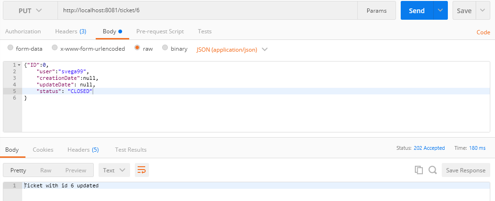
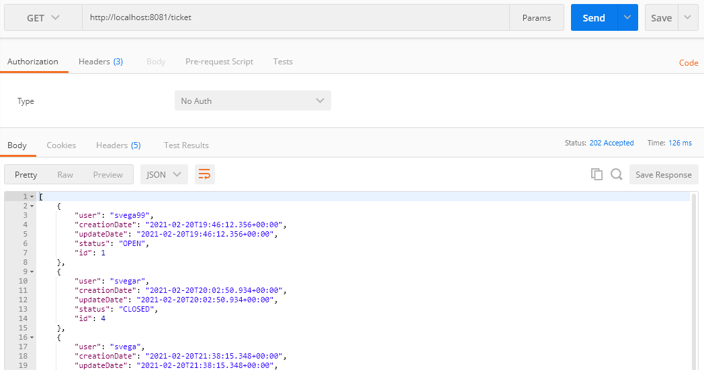

# Tickets

## Requisitos

### Java
 Java es necesario para correr el programa, para comprobar si esta instalado desde la linea de comandos:

```
>java -version

java version "1.8.0_181"
Java(TM) SE Runtime Environment (build 1.8.0_181-b13)
Java HotSpot(TM) 64-Bit Server VM (build 25.181-b13, mixed mode)
```

### Maven
El programa corre con maven, para comprobar si esta instalado desde la linea de comandos:

```
>mvn -v

Apache Maven 3.6.1 (d66c9c0b3152b2e69ee9bac180bb8fcc8e6af555; 2019-04-04T14:00:29-05:00)
Maven home: C:\Program Files\apache-maven-3.6.1\bin\..
Java version: 1.8.0_181, vendor: Oracle Corporation, runtime: C:\Program Files\Java\jdk1.8.0_181\jre
Default locale: es_CO, platform encoding: Cp1252
OS name: "windows 10", version: "10.0", arch: "amd64", family: "windows"
```

### Git
Para descargar el programa se necesita git, para comprobar si esta instalado desde la linea de comandos:

```
> git --version

git version 2.21.0.windows.1
```

### Redis
Se usa Redis para la persistencia, se debe ejecutar redis server mientras se corre el programa.

## Ejecutando el programa

Si quiere ejecutar el programa desde local se puede poner en la linea de comandos desde la ruta del proyecto:

```
> mvn spring-boot:run 

```

## Pruebas

Se usa postman para probar la API.

### Crear ticket

Para crear un ticket se usa la ruta y un cuerpo como el de la imagen siguiente. Los atributos "ID", "creationDate" y "updateDate" se generan por su cuenta en el código.


### Editar ticket

Para editar un ticket se usa la ruta de la imagen con el id correspondiente. Los unicos atributos editables son "user" y "status".



### Recuperar ticket

Recuperar todos:



Recuperar por ID:


### Eliminar ticket (por ID)

Para eliminar un ticket se usa la ruta de la imagen con el id correspondiente.


